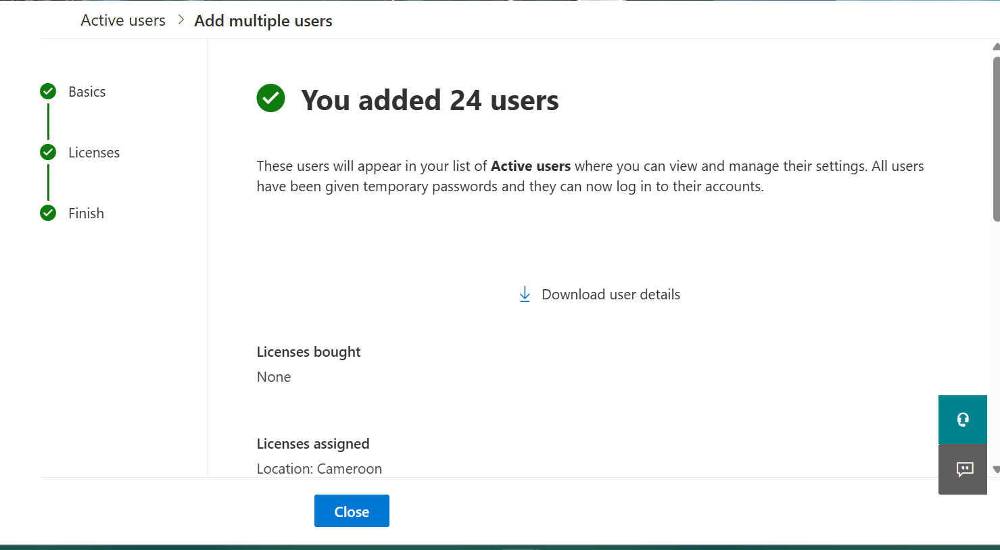
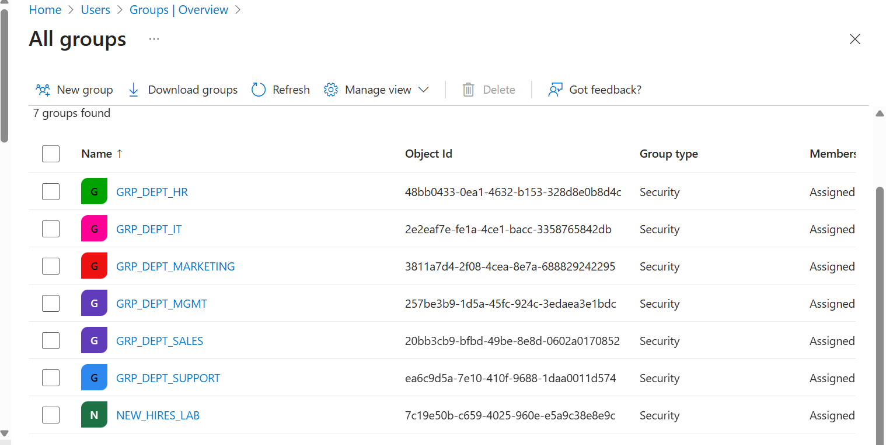
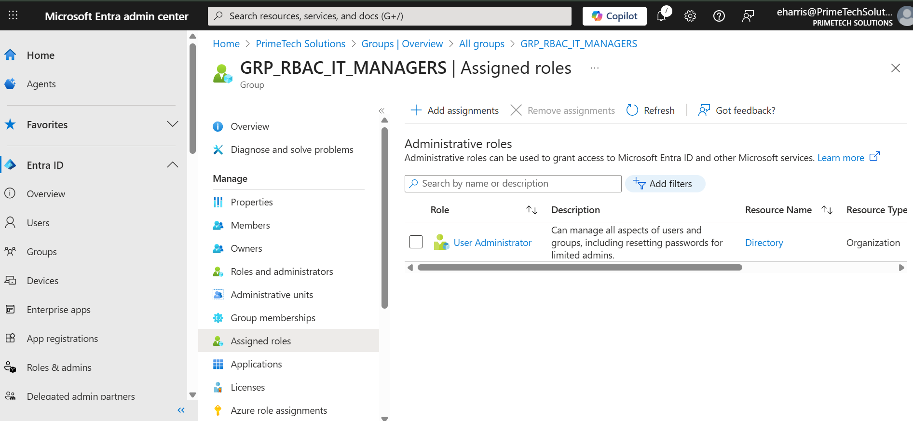
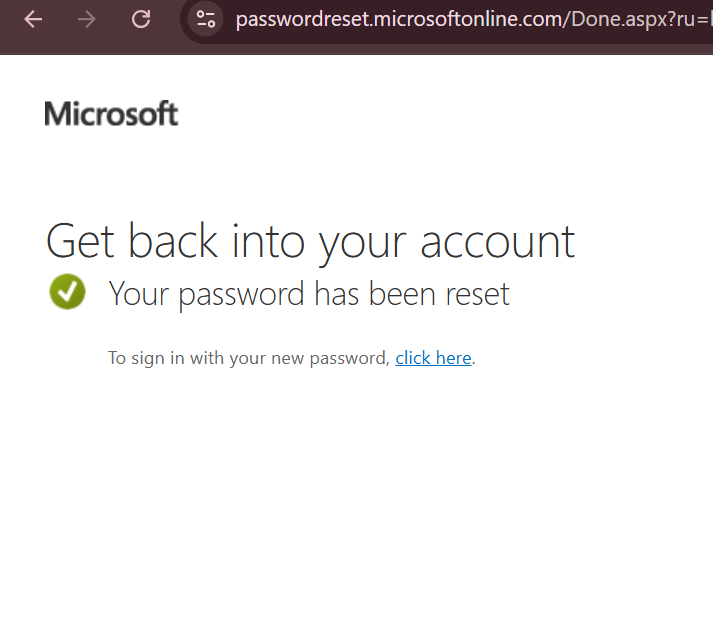
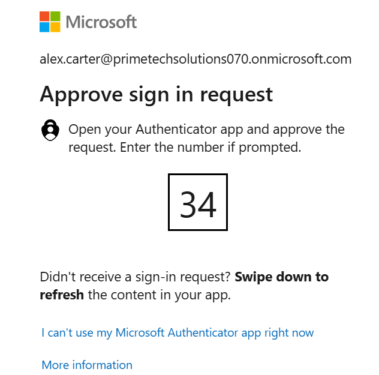

# Chapter 1: My Journey in Building Our Identity Foundation

## Scenario

As the new administrator for Primetech Solutions, my first major task was to establish a secure and scalable identity foundation in Microsoft 365. With 24 new employees starting, I needed to create their accounts, organize them into the correct departments, delegate administrative permissions using the principle of least privilege, and roll out foundational security features like Self-Service Password Reset (SSPR) and Multi-Factor Authentication (MFA). This is the log of the actions I took to build our identity infrastructure from the ground up.

## Ticket 1: Onboarding New Hires with a CSV Import

**My Mission:** HR provided a CSV file with details for 24 new hires. My task was to efficiently create user accounts for all of them without manual data entry.

**Actions I Took:**

1.  I navigated to the **Microsoft 365 admin center > Users > Active users**.
2.  I selected **Add multiple users** and uploaded the CSV file provided by HR.
3.  I ensured all users were mapped correctly and assigned a standard license and location.
4.  I completed the import process.

**Outcome:** I successfully created 24 new user accounts. The automated process was fast and eliminated the risk of manual typos, ensuring all new hires had their accounts ready on day one.

## Ticket 2: Structuring Departments with Security Groups

**My Mission:** To prepare for assigning permissions in SharePoint and Teams, I needed to organize the new users into groups based on their departments.

**Actions I Took:**

1.  I went to the **Microsoft Entra admin center > Groups**.
2.  I created six new **Security groups**, one for each department: `GRP_DEPT_HR`, `GRP_DEPT_IT`, `GRP_DEPT_SALES`, `GRP_DEPT_MGMT`, `GRP_DEPT_MARKETING`, and `GRP_DEPT_SUPPORT`.
3.  For each group, I added the corresponding users who belonged to that department.

**Outcome:** I created a clean, department-based group structure. This allows me to assign resources and permissions to a single group rather than to 24 individual users, which is much more efficient and scalable.

## Ticket 3: Delegating Permissions with a Role-Assignable Group

**My Mission:** The IT Director asked me to grant three IT managers the ability to manage user accounts, but nothing more. I needed to do this following the principle of least privilege.

**Actions I Took:**

1.  In the **Microsoft Entra admin center**, I created a new Security group named `GRP_RBAC_IT_MANAGERS`.
2.  During creation, I enabled the setting **Microsoft Entra roles can be assigned to the group**. This is a critical step for delegating admin rights.
3.  I then navigated to **Roles & administrators** and selected the **User Administrator** role.
4.  I assigned this role to my new `GRP_RBAC_IT_MANAGERS` group.
5.  Finally, I added the three IT managers as members of this group.

**Outcome:** I successfully delegated user administration permissions without making the managers Global Admins. They now have exactly the permissions they need, and I can easily manage access by simply adding or removing members from this one group.

## Ticket 4: Empowering Users with Self-Service Password Reset (SSPR)

**My Mission:** To reduce helpdesk tickets and empower users, I was tasked with enabling Self-Service Password Reset for all employees.

**Actions I Took:**

1.  In **Microsoft Entra ID > Protection > Password reset**, I enabled SSPR for the **All** users group.
2.  I configured the **Authentication methods**, requiring users to register at least two methods (e.g., Mobile app and Email) but only needing one to perform a reset.
3.  I enabled the **Registration** policy to **Require users to register when signing in**, ensuring adoption.
4.  I tested the policy by signing in as a user, `Scarlet Ortiz`, who was prompted to register her security info. I then went to `aka.ms/sspr` and successfully reset her password using the registered method.

**Outcome:** SSPR is now active for all users. This will significantly reduce the number of password-related support calls and allow employees to resolve lockout issues themselves, 24/7.

## Ticket 5: Securing Privileged Accounts with a Conditional Access Policy

**My Mission:** My top security priority was to protect our administrative accounts. I needed to create a Conditional Access policy to enforce MFA for all administrators.

**Actions I Took:**

1.  I navigated to **Microsoft Entra > Protection > Conditional Access** and created a new policy named `Require MFA for Admins`.
2.  For the user assignment, I targeted **Directory roles** and selected all privileged roles, including Global Administrator, User Administrator, etc.
3.  Under **Grant** controls, I selected **Require multi-factor authentication**.
4.  I enabled the policy in **Report-only** mode first to validate its impact, then switched it to **On**.
5.  I tested by signing in as an admin, `Alex Carter`, and confirmed he was prompted to set up and use MFA.

**Outcome:** All privileged accounts are now protected by MFA, drastically reducing the risk of an administrative account takeover.

## Navigation

- Next: [User & Licensing Administration](../02_User_and_Licensing_Administration/)
- Back to Root: [README](../README.md)

