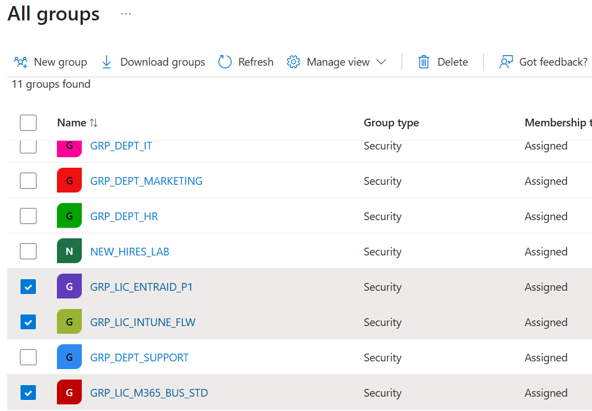
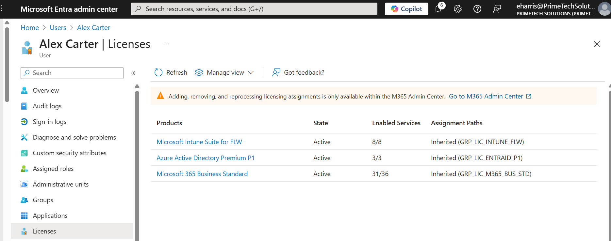
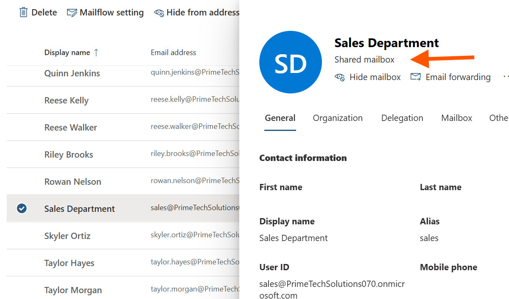

# Chapter 2: My Journey in Automating License Management

## Scenario

With our user accounts and basic security in place, my next critical task was to manage software licenses efficiently. The old method of assigning licenses one by one is slow and prone to error. My goal was to implement **group-based licensing**, a modern approach that automates license assignment, ensures consistency, and simplifies onboarding and offboarding. This is how I did it.

## Ticket 1: Building the Foundation with License Groups

**My Mission:** Before I could assign any licenses, I needed to create dedicated security groups for each type of license (SKU) we own. This would be the foundation of our new automated system.

**Actions I Took:**

1.  I navigated to the **Microsoft Entra admin center > Groups**.
2.  I created three new **Security groups**, carefully naming each one to reflect the license it would hold:
    *   `GRP_LIC_M365_BUS_STD` (for Microsoft 365 Business Standard)
    *   `GRP_LIC_ENTRAID_P1` (for Microsoft Entra ID P1)
    *   `GRP_LIC_INTUNE_FLW` (for Microsoft Intune Frontline Worker)
3.  I ensured the "Membership type" for each was set to **Assigned**, as I would be manually controlling the membership for now.

**Outcome:** I successfully created the core groups that will drive our license automation. This structure is clean, clear, and ready for licenses to be assigned to them.

## Ticket 2: Assigning Licenses to the Groups

**My Mission:** With the groups ready, it was time to attach the actual product licenses to them. Any user added to these groups will automatically inherit these licenses.

**Actions I Took:**

1.  I went to the **Microsoft 365 Admin Center > Billing > Your products**.
2.  For each product (like Microsoft 365 Business Standard), I selected the option to **Assign licenses**.
3.  Instead of assigning to a user, I assigned the license directly to the corresponding security group I had just created (e.g., assigned the M365 Business Standard license to the `GRP_LIC_M365_BUS_STD` group).
4.  I reviewed the service plans and left them all enabled for this assignment.

**Outcome:** The licenses are now linked to the groups. The system is now "live," and anyone I add to these groups should automatically receive the correct licenses and apps.

## Ticket 3: Piloting the New System with Test Users

**My Mission:** Before rolling this out to everyone, I needed to validate that the group-based licensing was working as expected with a small pilot group.

**Actions I Took:**

1.  **Added Pilot Users:** I chose two users, `Alex Carter` and `Cameron White`, for my pilot. I navigated to each of my three license groups (`GRP_LIC_M365_BUS_STD`, `GRP_LIC_ENTRAID_P1`, and `GRP_LIC_INTUNE_FLW`) and added both users as members.
2.  **Verified Inheritance:** I then went to one of the user's profiles (`Alex Carter`) in the Entra admin center and checked his **Licenses** tab. I could see that all the correct licenses were now listed with the assignment path showing **Inherited (group)**.
3.  **Confirmed App Access:** Finally, I signed in as `Alex Carter` and confirmed that he could see and access the Microsoft 365 apps, like Outlook and Teams, that were provisioned by the license.

**Outcome:** The pilot was a success. The system works perfectly: adding a user to a group automatically grants them the correct licenses and access to the associated applications.

## Ticket 4: Creating a Shared Mailbox for the Sales Team

**My Mission:** With user mailboxes being provisioned automatically, my next task was to create a central mailbox for the Sales department to handle incoming customer inquiries.

**Actions I Took:**

1.  I navigated to the **Exchange Admin Center > Recipients > Mailboxes** and selected **Add a shared mailbox**.
2.  I named it `Sales Department` and set the email address to `sales@PrimeTechSolutions070.onmicrosoft.com`.
3.  During the creation process, I added the members of the sales team as members of the shared mailbox. This granted them both **Full Access** (to open and manage the mailbox) and **Send As** (to send email from the `sales@` address) permissions.
4.  To test, I signed in as a sales team member, added the shared mailbox to my Outlook profile, and successfully sent an email from the `sales@PrimeTechSolutions070.onmicrosoft.com` address.

**Outcome:** The Sales team now has a fully functional shared mailbox. This centralizes their communication and presents a professional image to customers, as all replies will come from a single, departmental address.

## Navigation

- Previous: [Identity & Access Management](../01_Identity_and_Access_Management/)
- Next: [Collaboration Tools](../03_Collaboration_Tools/)
- Back to Root: [README](../README.md)