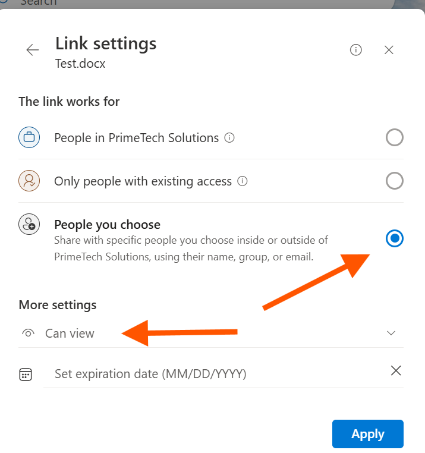
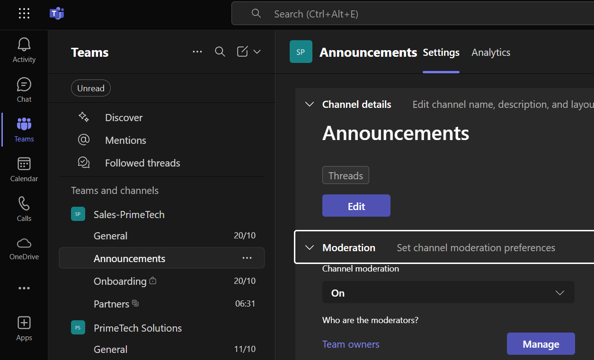
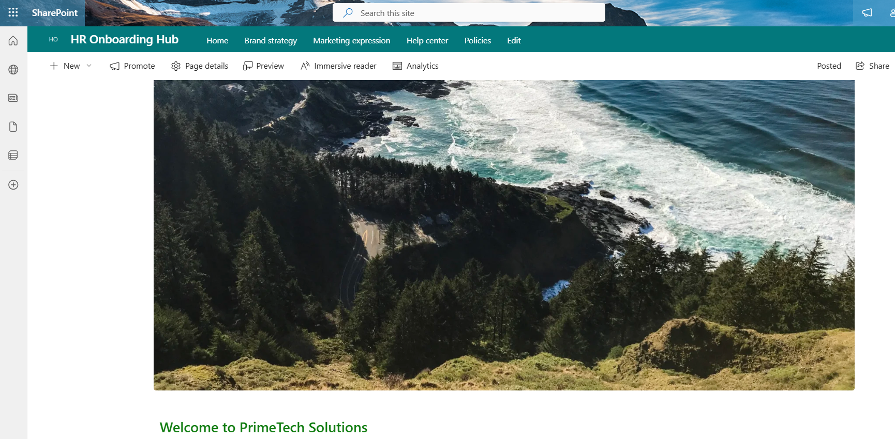
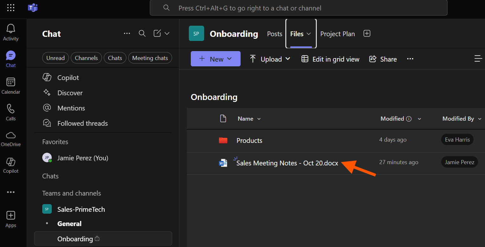
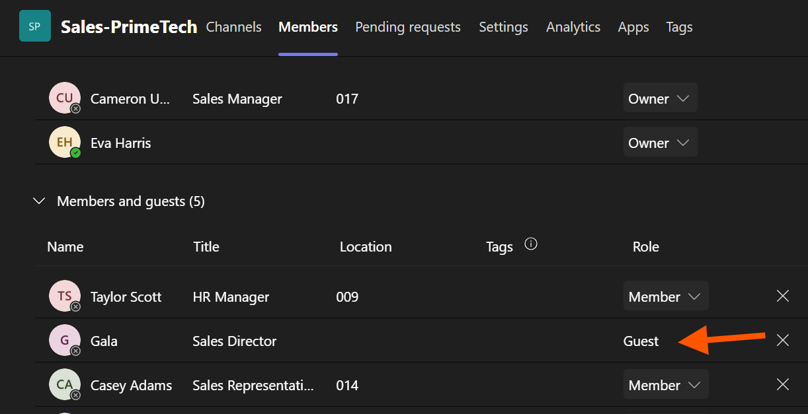

# Chapter 3: My Journey in Building Our Collaboration Workspace

## Scenario

With our identity and licensing foundations in place, my next task was to build out the collaboration infrastructure for Primetech Solutions. This involved setting up Microsoft Teams, SharePoint, and OneDrive to meet the needs of different departments while maintaining security. My goals were to establish safe sharing defaults, create a new Team for the Sales department with secure channels, build an HR onboarding hub on SharePoint, and demonstrate how to securely share files and recover from common mistakes.

## Ticket 1: Establishing Safe Collaboration Baselines

**My Mission:** Before anyone could create a Team or share a file, I needed to establish secure default settings across the organization to prevent accidental data leaks.

**Actions I Took:**

1.  **Locked Down Default Sharing:** In the **SharePoint admin center > Policies > Sharing**, I changed the default sharing link type for both SharePoint and OneDrive to **"Specific people."** This ensures that when a user clicks "Share," they are forced to enter the exact email addresses of the people they want to share with, preventing the creation of anonymous, organization-wide links by mistake.
2.  **Configured External Access:** In the **Teams admin center**, I reviewed our external access policies. I enabled **Guest access** to allow collaboration with external partners but configured the **External access** settings to block specific domains that we don't do business with.
3.  **Validated the Settings:** I confirmed my changes by opening a file in my OneDrive and seeing that the share dialog now defaulted to "Specific people." I also tested sharing a file with an email from a blocked domain and confirmed that the action was denied.

**Outcome:** I successfully established a "secure-by-default" posture for collaboration. Users can still share externally when needed, but the safest option is now the default, reducing our risk profile significantly.

## Ticket 2: Creating a Multi-Purpose Sales Team

**My Mission:** The Sales Director needed a new, private Microsoft Team for the department. It required a standard channel for announcements, a private channel for sensitive onboarding discussions, and a shared channel for collaborating with an external partner.

**Actions I Took:**

1.  **Created the Private Team:** In the Teams client, I created a new **Private** team named `Sales - Primetech` and assigned two owners to ensure redundancy.
2.  **Configured Channels:**
    *   I created a standard channel named `Announcements` and enabled **moderation** so that only team owners could post, keeping it clean and official.
    *   I created a **Private channel** named `Onboarding`. I added only the new hire and their manager to this channel, ensuring their performance discussions remained confidential. I noted that this created a separate, dedicated SharePoint site just for this channel's files.
    *   I created a **Shared channel** named `Partners` to prepare for collaboration with an external organization.

**Outcome:** The Sales department now has a structured and secure Team. The use of different channel types ensures that conversations and files are accessible only to the appropriate people, balancing open collaboration with confidentiality.

## Ticket 3: Building an HR Onboarding Hub on SharePoint

**My Mission:** HR needed a central, internal-only site to publish onboarding materials for all new hires. This site needed to be easily accessible from the Sales Team.

**Actions I Took:**

1.  **Created a Communication Site:** In the **SharePoint admin center**, I created a new **Communication site** named `HR Onboarding Hub`. I immediately went into the site's permissions and disabled external sharing to ensure all content remained internal.
2.  **Populated Content:** I created a new document library named `Policies` and uploaded the employee handbook. I also published a "Welcome to Primetech Solutions" news post on the site's homepage.
3.  **Integrated with Teams:** I went back to the `Sales - Primetech` Team and, in the "General" channel, I added a new **tab** linking directly to the `HR Onboarding Hub`'s homepage.

**Outcome:** HR now has a beautiful, easy-to-manage site for their content. By adding it as a tab in Teams, I made it seamlessly accessible to new hires right within the application they'll be using every day.

## Ticket 4: Demonstrating Secure File Recovery

**My Mission:** A user accidentally deleted an important file from the Sales Team and overwrote another with incorrect information. I needed to demonstrate how to recover from both of these common mistakes.

**Actions I Took:**

1.  **Restored from Recycle Bin:** For the deleted file, I navigated to the SharePoint site connected to the Sales Team. I opened the **Recycle Bin**, found the deleted file, selected it, and clicked **Restore**. The file was immediately returned to its original location.
2.  **Restored a Previous Version:** For the overwritten file, I located the document in the library, clicked the ellipsis (...), and selected **Version History**. I found the correct version from before the accidental overwrite and clicked **Restore**.

**Outcome:** I successfully recovered both files in minutes. This demonstrated to the team that Microsoft 365 has robust, built-in safety nets that protect against common user errors, providing peace of mind.

## Ticket 5: Managing External Collaboration (Guest vs. B2B Direct Connect)

**My Mission:** The Sales team needed to collaborate with an external consultant who had a Gmail address and a key partner from another Microsoft 365 organization. I had to use two different technologies to provide the correct type of access.

**Actions I Took:**

1.  **Invited a Standard Guest:** For the consultant with the Gmail address, I went to the `Sales - Primetech` Team and simply added their email address as a new member. This sent them a **B2B Guest** invitation. Once they accepted, they appeared as a guest in our directory and could access the team by switching tenants in their Teams client.
2.  **Configured B2B Direct Connect:** For the partner organization, they needed access to the `Partners` **Shared Channel** without having to switch tenants. This required **B2B Direct Connect**.
    *   I obtained the partner's Tenant ID.
    *   In the **Microsoft Entra admin center > External Identities > Cross-tenant access settings**, I added their organization and configured a mutual trust for B2B direct connect on both the inbound and outbound settings. (The partner admin had to do the same on their end).
3.  **Cleaned Up:** Once the project was over, I removed the guest user from the Team and then deleted their guest account from our Entra ID to ensure no lingering access remained.

**Outcome:** I learned and implemented the two primary methods for external collaboration. I now understand that standard guest invites are for broad, team-level access, while B2B Direct Connect is a more seamless, admin-to-admin configured trust required for Shared Channels.

## Navigation

- Previous: [User & Licensing Administration](../02_User_and_Licensing_Administration/)
- Next: [Security & Compliance](../04_Security_and_Compliance/)
- Back to Root: [README](../README.md)