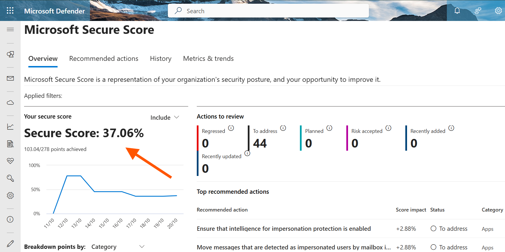
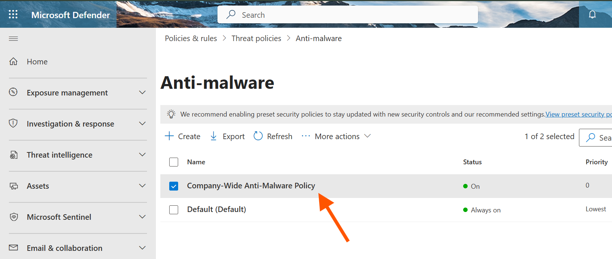
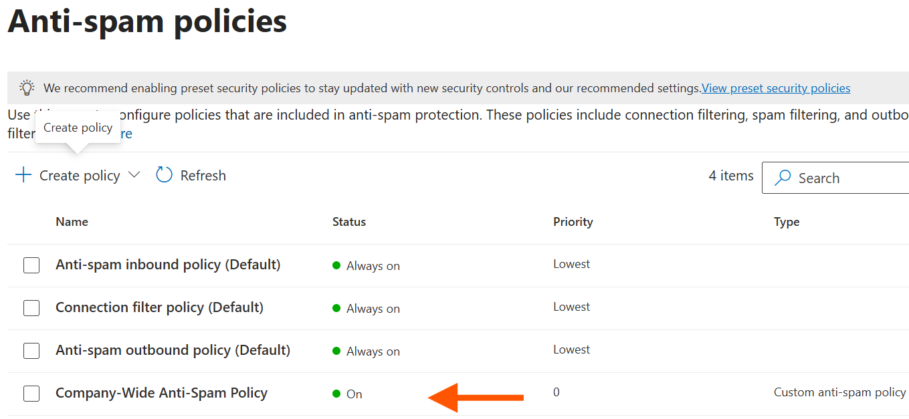
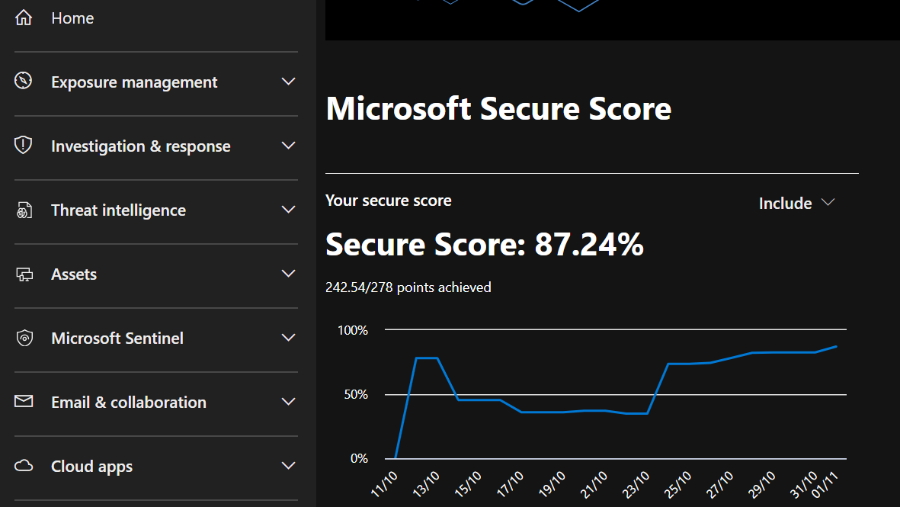

# Chapter 4: My Journey in Hardening Security and Ensuring Compliance

## Scenario

With our company's identity foundation in place, I was tasked by the CISO and department heads to harden our Microsoft 365 environment. My focus was on using the built-in security tools to measure our posture, protect against email-based threats, and enable compliance features. This is a log of the actions I took.

## Ticket 1: Baselining and Improving Our Microsoft Secure Score

**My Mission:** The CISO asked me to get a clear picture of our current security posture and take immediate steps to improve it. Microsoft Secure Score was the tool for the job.

**Actions I Took:**

1. **Established a Baseline:** I navigated to the **Microsoft 365 Defender portal > Secure score**. I recorded our initial score, which was **37.06%**. This served as our starting point.

    

2. **Analyzed Recommendations:** I reviewed the "Recommended actions" and noted that "Block legacy authentication" was already completed by Microsoft's Security Defaults. I then identified that the next highest-impact actions were all related to anti-phishing.

3. **Implemented a Stricter Anti-Phishing Policy:** Instead of tackling the recommendations one-by-one, I created a single, comprehensive policy that addressed most of them.
    * I went to **Email & collaboration > Policies & rules > Threat policies > Anti-phishing** and clicked **Create**.
    * I named it `Company-Wide Anti-Phishing Policy` and applied it to our entire domain to ensure everyone was covered.
    * Under **Protection Settings**, I enabled **Spoof intelligence**.
    * Under **Actions**, I configured all detections (like impersonation and spoofing) to **Quarantine the message**, preventing them from reaching user inboxes.
    * I submitted the policy, ensuring it had the highest priority.

**Outcome:** By implementing this single policy, I addressed multiple high-impact security recommendations, significantly improving our defense against phishing attacks.

## Ticket 2: Hardening Our Anti-Malware Defenses

**My Mission:** The IT Security Lead tasked me with making our anti-malware policy more aggressive, specifically to block dangerous file types commonly used in attacks.

**Actions I Took:**

1. **Navigated to Anti-Malware Policies:** In the Defender portal, I went to **Email & collaboration > Policies & rules > Threat policies > Anti-malware**.
2. **Created a New, Stricter Policy:**
    * I clicked **Create** and named the policy `Company-Wide Anti-Malware Policy`.
    * I applied it to our entire domain.
    * Under **Protection Settings**, I enabled the **Common Attachments Filter**. This was the key step to block files like `.exe` and `.vbs`.
    * I set the quarantine policy to `AdminOnlyAccessPolicy`, ensuring only admins can release potential malware.
    * I verified that **Zero-hour auto purge (ZAP)** was enabled as a safety net.
3. **Set Priority:** After creating the policy, I confirmed it had a priority of `0`, making it the first policy to be evaluated.

**Outcome:** I successfully created a new anti-malware policy that is now the first line of defense for the entire company, actively blocking a wide range of potentially malicious attachments.

## Ticket 3: Implementing a "Quarantine-First" Anti-Spam Strategy

**My Mission:** My goal was to change our anti-spam strategy from moving junk mail to user folders to a more secure model where all spam is quarantined centrally.

**Actions I Took:**

1. **Navigated to Anti-Spam Policies:** I went to **Email & collaboration > Policies & rules > Threat policies > Anti-spam**.
2. **Created a New Inbound Policy:**
    * I clicked **Create policy > Inbound** and named it `Company-Wide Anti-Spam Policy`.
    * I applied it to our entire domain.
    * I set the **Bulk email threshold** to a more aggressive level (`6`) to better catch unwanted marketing emails.
    * Under the **Actions** section, I changed the action for both **Spam** and **High confidence spam** to **`Quarantine message`**. This was the core change to our strategy.
    * I also hardened the policy by turning on "Mark as spam" for emails that failed **SPF record: hard fail** and that contained **links to .biz or .info websites**.
3. **Set Priority:** I confirmed the new policy was set to Priority `0`.

**Outcome:** I successfully shifted our company's spam handling to a more secure, centralized model. All suspected spam is now held in quarantine for review, reducing the risk of users interacting with malicious mail.

**Update (11/1/2025): Secure Score Improvement**

- After implementing the email security policies from Tickets 2 and 3, and addressing several high-impact recommendations from the Secure Score dashboard, our score improved significantly. Key actions taken include:
  - Enabling Microsoft Entra ID Identity Protection for both sign-in and user risk.
  - Enforcing MFA for all users via Security Defaults.
  - Hardening anti-malware and anti-spam rules to quarantine threats.
- As a result, our Microsoft Secure Score increased from a baseline of **37.06%** to **87.24%**.
- Evidence: Microsoft 365 Defender > Secure score dashboard captured on 11/1/2025

## Navigation

- Previous: [Collaboration Tools](../03_Collaboration_Tools/)
- Next: [Device Management (Intune)](../05_Device_Management_Intune/)
- Back to Root: [README](../README.md)