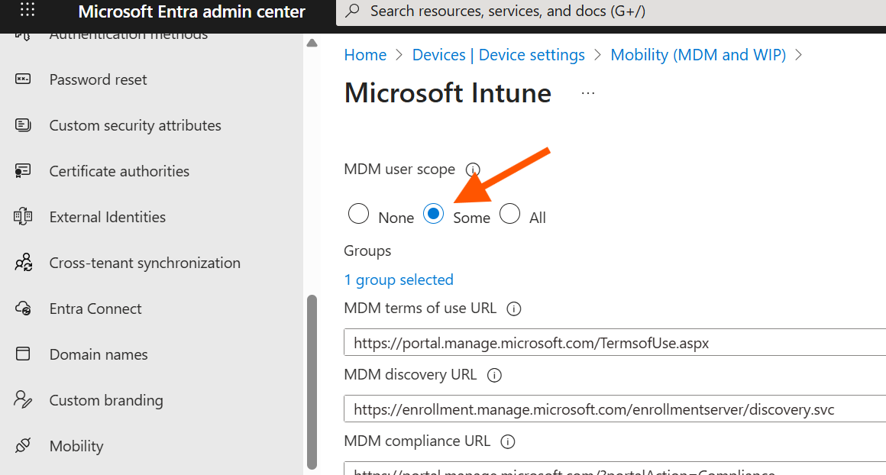
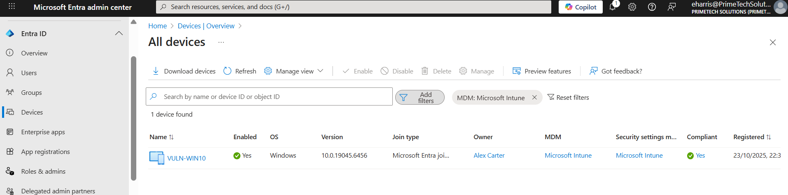
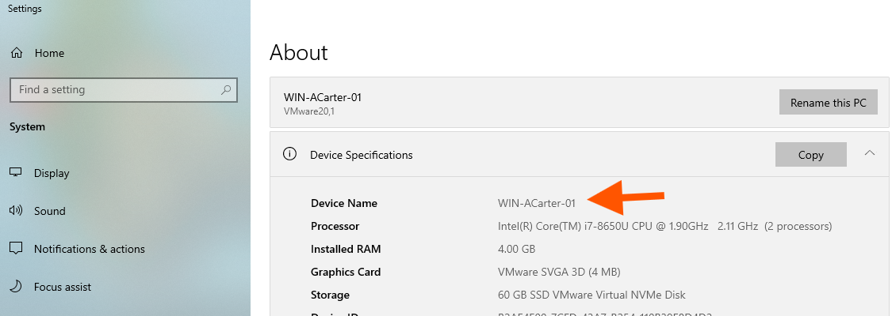

# Chapter 5: My Journey into Modern Device Management with Intune

## Scenario

With our users, licenses, and security policies in place, the next frontier is managing the devices our employees use to access company data. The old way of managing on-premises devices doesn't work for a modern, remote workforce. My goal for this chapter is to implement **Microsoft Intune** as our Mobile Device Management (MDM) solution. This will allow me to secure and manage our company's Windows devices from the cloud, ensuring they are compliant with our security standards no matter where they are.

## Ticket 1: Preparing the Environment for Automatic Enrollment

**My Mission:** Before I can enroll any devices, I need to configure our tenant to support **automatic enrollment**. The goal is to create a seamless experience where a Windows device automatically enrolls into Intune the moment a licensed user joins it to our organization's network (Entra ID).

**Actions I Took:**

1.  **Verified Licensing:** I first confirmed that my users have the necessary licenses. The Microsoft 365 licenses I assigned in Chapter 2 already include a license for Microsoft Intune, so no extra work was needed here.

2.  **Configured MDM User Scope:** This is the most critical step. I needed to tell Entra ID which users are allowed to enroll devices into Intune.
    *   I navigated to the **Microsoft Entra admin center**.
    *   I went to **Entra ID > Devices > Overview > Device settings**.
    *   I found the setting **"Users may join devices to Microsoft Entra"** and ensured it was set to **All**.
    *   Next, I went back to **Entra ID > Mobility >** and I clicked on **Microsoft Intune**.
    *   In the configuration pane, I set the **MDM user scope** to **Some**. This is a more secure practice than allowing "All" users. I selected the specific security group **`GRP_DEPT_IT`** to grant enrollment rights only to members of the IT department.
    *   **Crucial Step:** I then verified that my test user, `Alex Carter`, was a member of the `GRP_DEPT_IT` group. This ensures that only the correct users are permitted to enroll devices.

3.  **Understood the CNAME Requirement:** I learned that for automatic enrollment to work seamlessly with a custom domain, two DNS CNAME records are required:
    *   `enterpriseenrollment.yourdomain.com` pointing to `enterpriseenrollment.manage.microsoft.com`
    *   `enterpriseregistration.yourdomain.com` pointing to `enterpriseregistration.windows.net`
    *   **Lab Note:** Since I am primarily using the default `.onmicrosoft.com` domain for this lab, Microsoft has already configured these records for me. If I were doing this in a production environment with a custom domain, I would need to add these records at my domain registrar (like GoDaddy, Namecheap, etc.).

**Outcome:** My Microsoft 365 tenant is now fully configured for automatic Intune enrollment. The backend is ready. The next step is to take a Windows 10 device and join it to our organization to see this process in action.

## Ticket 2: Enrolling My First Windows Device into Intune

**My Mission:** With the backend configured, it was time for the real test: enrolling a live Windows device. My goal was to take a standard, unmanaged Windows 10 machine and join it to our organization, triggering the automatic enrollment process I just set up.

**Actions I Took (On the Windows 10 VM Device):**

1.  **Navigated to Account Settings:** I opened the Windows **Settings** app, went to **Accounts**, and then selected **Access work or school**.

2.  **Connected the Device:** I clicked the **Connect** button. In the pop-up window, instead of entering an email address, I chose the option at the bottom: **"Join this device to Microsoft Entra ID"**.

3.  **Authenticated as the User:** The system prompted me to sign in. I used the credentials of one of my licensed users, `Alex Carter`. After entering the password and completing the MFA prompt, I was asked to confirm that I was joining the organization `Primetech Solutions`. I confirmed.

4.  **Completed the Process:** After a few moments, the system confirmed the device was successfully joined. In the "Access work or school" settings, I could now see my connection to the Primetech Solutions Entra ID, with an icon indicating it was also managed by MDM.

**Validation (In the Admin Portals):**

1.  **Checked Entra ID:** I went back to the **Microsoft Entra admin center > Devices > All devices**. After a few minutes, the new Windows device appeared in the list. I noted that the "Join Type" was **"Microsoft Entra joined"** and the "MDM" column showed **"Microsoft Intune"**.

2.  **Checked Intune:** I then navigated to the **Microsoft Intune admin center > Devices > Windows**. My newly enrolled device was listed there, showing that it was compliant and successfully managed by Intune.

**Outcome:** Success! The automatic enrollment process worked perfectly. The Windows device is now fully managed by Intune, which means I can start applying security policies, deploying applications, and monitoring its compliance from a single, cloud-based console.

## Ticket 3: Troubleshooting a Failed Enrollment

**My Mission:** After following the steps to join my VM to Entra ID, I hit a major roadblock. The device appeared in the Entra admin center, but its MDM status was listed as **"None,"** and it never appeared in the Intune portal. I had to put on my detective hat and figure out what was breaking the enrollment process.

**My Troubleshooting Journey:**

This was a multi-step investigation where I systematically checked all the potential points of failure from the cloud to the client.

1. **Checked the User License:** My first thought was licensing. I confirmed my test user, `Alex Carter`, had an active Intune license assigned. This was correct.

2. **Checked the MDM User Scope:** Next, I investigated the MDM user scope in the **Entra admin center**.
    * Initially, it was set to "All." To be more precise and follow best practices, I changed it to **"Some"** and selected my specific `GRP_DEPT_IT` security group.
    * I double-checked that `Alex Carter` was a member of this group. This was also correct.

3. **Checked Local Admin Rights:** The error message on the VM mentioned administrator rights. I confirmed that the account I was using to perform the join on the VM was a member of the local "Administrators" group on that machine. This was correct.

4. **Checked Enrollment Restrictions:** I then checked for any Intune policies that might be blocking the enrollment. In the **Intune admin center**, I navigated to **Devices > Enrollment > Enrollment device platform restrictions**. I checked the default policy and confirmed that Windows (MDM) enrollment was set to **"Allow."** This was also correct.

5. **Checked Device Limits:** I considered that my user might have hit a device enrollment limit from previous failed attempts. In the **Entra admin center > Devices > Device settings**, I confirmed the "Maximum number of devices per user" was set to a high number (50). I also checked Alex Carter's user profile and deleted any stale device objects associated with him.

6. **Discovered the Root Cause: MDM Authority:** After all those checks, I finally found the core issue in the **Intune admin center > Tenant admin > Tenant status**. The **MDM authority** for the entire tenant was not set. This is the master switch that tells Entra ID where to send devices for management. Without it, the hand-off from Entra to Intune could never happen.

**The Fix:**

I couldn't find an obvious banner in the portal prompting me to set the MDM authority. After researching the issue, I found a Microsoft documentation article that provided a direct link to the correct settings page: [https://intune.microsoft.com/#view/Microsoft_Intune_Enrollment/ChooseMDMAuthorityBlade](https://intune.microsoft.com/#view/Microsoft_Intune_Enrollment/ChooseMDMAuthorityBlade).

* This link took me directly to the "Choose MDM Authority" configuration blade.
* From there, I selected **"Intune MDM Authority"** to finalize the setup.

**Outcome:** After setting the MDM authority, I disconnected the VM from Entra, restarted it, and went through the join process one last time. **It worked perfectly.** The device appeared in both Entra ID and the Intune portal with the correct status. This troubleshooting process was a critical learning experience in understanding all the interconnected pieces required for a successful Intune enrollment.

## Ticket 4: Renaming a Device Using a Remote Action

**My Mission:** My enrolled VM had the name `vuln-win10`, a leftover from a previous project. While this name doesn't cause technical issues, it's not descriptive and could be confusing later. My goal is to use one of Intune's **remote actions** to rename the device to `WIN-ACarter-01`, following a clear naming convention, directly from the Intune portal.

**Actions I Took:**

1.  **Located the Device in Intune:** I navigated to the **Microsoft Intune admin center > Devices > Windows** and selected my target device.

2.  **Initiated the Rename Action:** On the device's overview page, I located and clicked the **Rename** button in the top toolbar.

3.  **Entered the New Name:** A new pane appeared on the right. In the "New name" field, I entered `WIN-ACarter-01`.
    *   **Important Note:** Intune provides a placeholder showing how to use the `%SERIAL%` or `%DEVICETYPE%` variable for bulk operations, but for a single device, I just typed the specific name I wanted.

4.  **Confirmed the Action:** I clicked the **Rename** button at the bottom of the pane to confirm the action.
    *   **Lab Note:** The rename pane has a toggle for **"Restart after rename."** A restart is required for the name change to take effect. For this lab, I enabled this option to complete the process immediately. In a real production environment, you would typically leave this disabled to avoid unexpectedly restarting a user's machine during their workday. The name change would then apply the next time they manually restart.

**Validation:**

*   **In the Intune Portal:** The "Rename device" action appeared in the "Device actions status" list with a "Pending" status. The device restarted automatically as commanded. After it came back online and synced, the status changed to "Completed," and the device name in the Intune portal updated to `WIN-ACarter-01`.
*   **On the VM:** After the automatic restart, I confirmed the new name was reflected in the Windows System Properties.

**Outcome:** I successfully performed a remote management action on my enrolled device. This was a powerful demonstration of how Intune allows me to manage devices from anywhere without needing to physically touch them or use remote desktop. The device now has a clear, descriptive name that aligns with a proper administrative naming convention.

## Navigation

- Previous: [Security & Compliance](../04_Security_and_Compliance/)
- Next: [Part 2: Compliance and Configuration Policies](./02-compliance-and-configuration-policies.md)
- Back to Root: [README](../README.md)