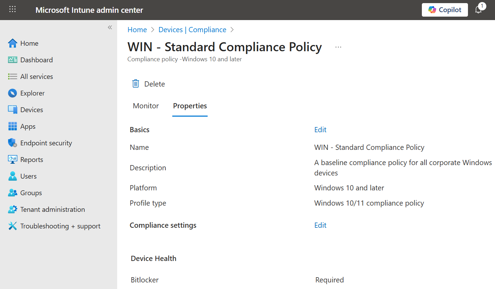
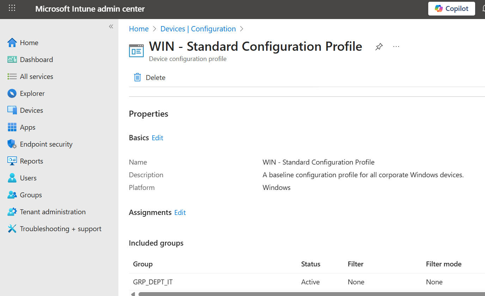

# Chapter 5, Part 2: Defining Device Standards with Policies

## Scenario

My Windows 10 VM is now successfully enrolled in Intune and has a proper name. However, just being enrolled isn't enough. I need to ensure it meets our company's security standards. My goal is to use Intune to define what a "healthy" and "secure" device looks like. I'll start by creating a **Compliance Policy**, which acts as a set of rules the device must follow to be considered compliant. If a device falls out of compliance, I can then create rules to, for example, block it from accessing company data.

## Ticket 1: Creating a Basic Windows Compliance Policy

**My Mission:** My first step is to create a foundational compliance policy for our Windows devices. This policy will check for basic security hygiene: ensuring the device has a password, is not jailbroken, and has a minimum OS version.

**Actions I Took:**

1. **Navigated to Compliance Policies:** In the **Microsoft Intune admin center**, I went to **Devices > Compliance**.

2. **Created a New Policy:** I clicked the **Create policy** button.
    * For **Platform**, I chose **Windows 10 and later**.
    * For **Profile type** I select **Windows 10/11 compliance policy**.
    * I clicked **Create**.

3. **Configured Basic Information:**
    * **Name:** `WIN - Standard Compliance Policy`
    * **Description:** `A baseline compliance policy for all corporate Windows devices.`
    * I clicked **Next**.

4. **Set Compliance Settings:** This is where I defined the actual rules. I expanded the different categories and configured the following:
    * **Device Health:**
        * Require BitLocker: **Require**
    * **System Security:**
        * Require a password to unlock mobile devices: **Require**
        * Minimum password length: `12`
        * Password complexity: **Alphanumeric**
    * **Device Properties:**
        * Minimum OS version: `10.0.19045` (This corresponds to Windows 10, 22H2. I found this by running `winver` on my VM).

5. **Defined Actions for Noncompliance:** I left the action for noncompliance at the default setting for now:
    * **Action:** Mark device noncompliant
    * **Schedule (days after noncompliance):** Immediately
    * This means as soon as a device fails a check, it will be flagged in the Intune portal. I clicked **Next**.

6. **Assigned the Policy:**
    * Under **Included groups**, I clicked **Add groups** and selected my **`GRP_DEPT_IT`** security group. This ensures the policy only applies to our test devices for now.
    * I clicked **Next**.

7. **Reviewed and Created:** I reviewed the summary of my settings and clicked **Create** to finalize and deploy the policy.

**Validation:**

* After creating the policy, I went to my device's page in Intune (**Devices > Windows > WIN-ACarter-01**).
* I clicked on **Device compliance** in the left-hand menu.
* Initially, the status for my new policy was "Not evaluated." To speed things up, I initiated a **Sync** from the device.
* After a few minutes, the policy status updated to **"Compliant,"** confirming that my VM meets all the rules I just defined.

**Outcome:** I have successfully created and assigned my first Intune compliance policy. This is a fundamental step in securing our devices. Any device used by the IT department must now meet these minimum security requirements to be considered compliant.

## Ticket 2: Enforcing Settings with a Configuration Profile

**My Mission:** My compliance policy checks if a device is secure, but it doesn't enforce the settings itself. My next mission is to create a **Configuration Profile** to actively configure and harden my Windows devices. I'll start by creating a profile that enforces a strong password policy, going beyond just checking if a password exists.

**Actions I Took:**

1.  **Navigated to Configuration Profiles:** In the **Microsoft Intune admin center**, I went to **Devices > Configuration**.

2.  **Created a New Profile:**
    *   I clicked **Create > New policy**.
    *   **Platform:** `Windows 10 and later`
    *   **Profile type:** `Settings catalog`
    *   I clicked **Create**.

3.  **Configured Basic Information:**
    *   **Name:** `WIN - Standard Configuration Profile`
    *   **Description:** `A baseline configuration profile for all corporate Windows devices.`
    *   I clicked **Next**.

4.  **Added Configuration Settings:** This is where I used the **Settings picker** to find and configure the specific policies I wanted to enforce.
    *   I clicked **+ Add settings**.
    *   In the settings picker, I searched for the **Device Lock** category.
    *   I checked the boxes for the following settings:
        *   `Device Password Enabled`
        *   `Device Password Expiration`
        *   `Device Password History`
        *   `Device Password Minimum Length`
        *   `Device Password Required Type`
    *   I closed the settings picker.

5.  **Configured the Selected Settings:** Back on the configuration settings page, I set the following values:
    *   **Device Password Enabled:** `True`
    *   **Device Password Expiration:** `90` (days)
    *   **Device Password History:** `5` (passwords remembered)
    *   **Device Password Minimum Length:** `12`
    *   **Device Password Required Type:** `Alphanumeric`
    *   I clicked **Next**.

6.  **Assigned the Profile:**
    *   Under **Included groups**, I clicked **Add groups** and selected my **`GRP_DEPT_IT`** security group.
    *   I clicked **Next**.

7.  **Reviewed and Created:** I reviewed the summary and clicked **Create**.

**Validation:**

*   In Intune, I navigated to the device's **Device configuration** page and saw my new profile listed with a "Succeeded" status after a sync.
*   **On the VM:** To truly test this, I tried to change my password to something simple like "Password123". Windows blocked me, showing an error that my password did not meet the length, complexity, or history requirements of my organization.

**Outcome:** I have now moved from passive checks (compliance) to active enforcement (configuration). Intune is now actively managing the security settings on my device, ensuring it adheres to the policies I've defined. This combination of compliance and configuration is the core of modern device management.

## Navigation

- Previous: [Part 1: Setup and Enrollment](./01-intune-setup-and-enrollment.md)
- Next: [Part 3: Windows Autopilot Setup](./03-windows-autopilot-setup.md)
- Back to Root: [README](../README.md)
