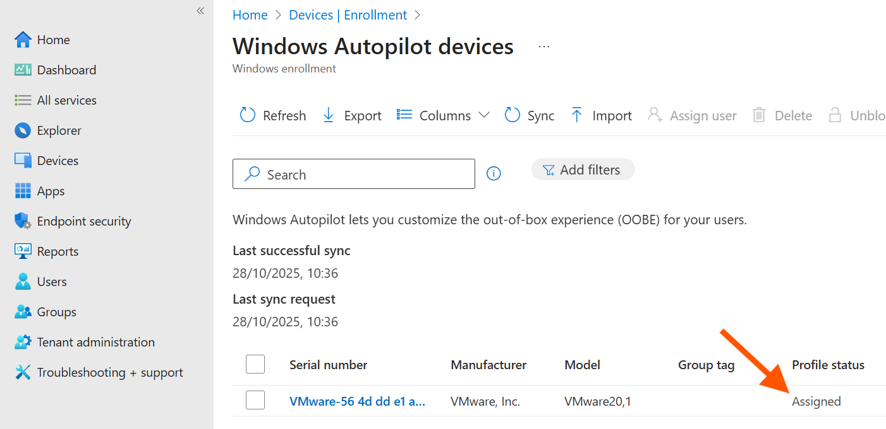

# Chapter 5, Part 3: Zero-Touch Deployments with Windows Autopilot

## Scenario

I've successfully enrolled a device manually and applied policies, but this doesn't scale. The gold standard for deploying new corporate devices is **Windows Autopilot**, a "zero-touch" provisioning system. My goal is to configure Autopilot so that a new device, fresh from the factory, can be shipped directly to an employee and automatically configure itself with all our company policies and apps just by having the user sign in.

Since I don't have a hardware vendor to upload device information for me, I will simulate the process by manually extracting the unique **hardware hash** from my existing VM and registering it in Intune.

## Ticket 1: Capturing a Hardware Hash and Creating a Deployment Profile

**My Mission:** To prepare for my first Autopilot deployment, I need to perform two key administrative tasks:
1.  Capture the hardware identity (hash) of my "new" device (the VM).
2.  Create an Autopilot Deployment Profile that defines the out-of-box experience (OOBE) for any device assigned to it.

**Actions I Took (Part 1: Capturing the Hash):**

1.  **Opened PowerShell on the VM:** On my `WIN-ACarter-01` VM, I opened a PowerShell window as an Administrator.

2.  **Installed the Script:** I installed the `Get-WindowsAutoPilotInfo` script directly from the PowerShell Gallery by running:
    ```powershell
    Install-Script -Name Get-WindowsAutoPilotInfo
    ```
    I accepted the prompts to install from an untrusted repository and install NuGet.

3.  **Set Execution Policy:** To allow the script to run, I changed the execution policy for the current process:
    ```powershell
    Set-ExecutionPolicy -Scope Process -ExecutionPolicy Unrestricted
    ```

4.  **Ran the Script to Generate the Hash File:** I ran the script and directed it to create a CSV file with the hardware hash. To avoid potential issues with user profile paths, I saved it directly to the root of the C: drive.
    ```powershell
    Get-WindowsAutoPilotInfo.ps1 -OutputFile C:\device-hash.csv
    ```

5.  **Retrieved the File:** I now had a CSV file at `C:\device-hash.csv` containing the unique hardware identifier for my VM, ready to be uploaded to Intune.

**Actions I Took (Part 2: Registering the Device and Creating the Profile):**

1.  **Navigated to Autopilot Devices:** In the **Microsoft Intune admin center**, I went to **Devices > Enrollment > Windows Autopilot Devices**.

2.  **Imported the Hash:** I clicked the **Import** button. In the pane that appeared, I selected the `device-hash.csv` file I just created and clicked **Import**.
    *   **Note:** The import process can take several minutes. I monitored the status until it showed as complete. My device was now registered with the Autopilot service.

3.  **Created a Deployment Profile:** Next, I navigated to **Devices > Enrollment > Windows Autopilot deployment profiles**.
    *   I clicked **Create Profile > Windows PC**.
    *   **Name:** `Standard Autopilot Profile`
    *   **Convert all targeted devices to Autopilot:** I left this set to **No**, as I am only targeting pre-registered devices.
    *   I clicked **Next**.

4.  **Configured the Out-of-Box Experience (OOBE):**
    *   **Deployment mode:** `User-Driven` (This is standard for devices assigned to a specific user).
    *   **Join to Microsoft Entra ID as:** `Microsoft Entra joined`.
    *   **Microsoft Software License Terms:** `Hide`
    *   **Privacy Settings:** `Hide`
    *   **User account type:** `Standard` (This is a critical security setting to ensure users are not local admins).
    *   I left the other settings at their defaults and clicked **Next**.

5.  **Assigned the Profile:**
    *   I assigned this profile to my `GRP_DEPT_IT` group. This means any device in that group that is also registered with Autopilot will get this OOBE experience.
    *   I clicked **Next**, reviewed the summary, and clicked **Create**.

**Actions I Took (Part 3: Assigning the Device and Verifying):**

1.  **Added Device to Group:** I navigated to **Groups > All groups** and selected the `GRP_DEPT_IT` group.
    *   I clicked **Members > + Add members**.
    *   I searched for my VM's device object (by its serial number/hostname) and added it to the group. This is the crucial step that links the device to the profile.

2.  **Verified Profile Assignment:** To confirm the link was successful, I went back to **Devices > Enrollment > Devices** (under the Autopilot section).
    *   I located my device and observed the **Profile status** column.
    *   After waiting several minutes and using the **Sync** button, the status changed from "Not assigned" to **"Assigned"**. This confirmed the device was ready for reset.



**Outcome:** I have successfully completed the backend setup for a Windows Autopilot deployment. I've registered a device, created a profile, and correctly assigned the device to the profile. The final step will be to reset my VM and watch Autopilot take over when it first boots up.

## Navigation

- Previous: [Security & Compliance](../04_Security_and_Compliance/)
- Next: [Reporting & Metrics](../06_Reporting_and_Metrics/)
- Back to Root: [README](../README.md)
