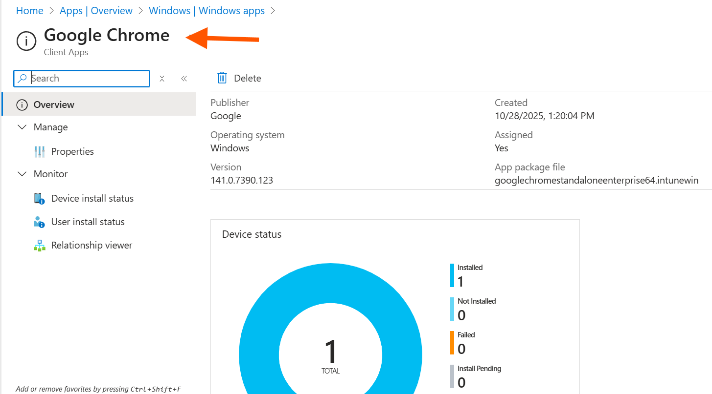
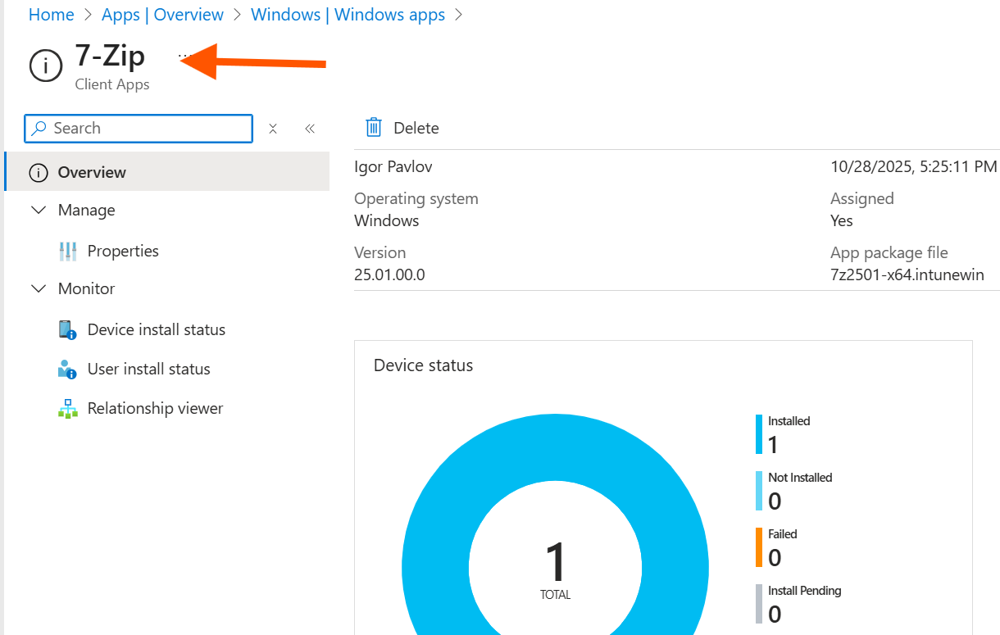
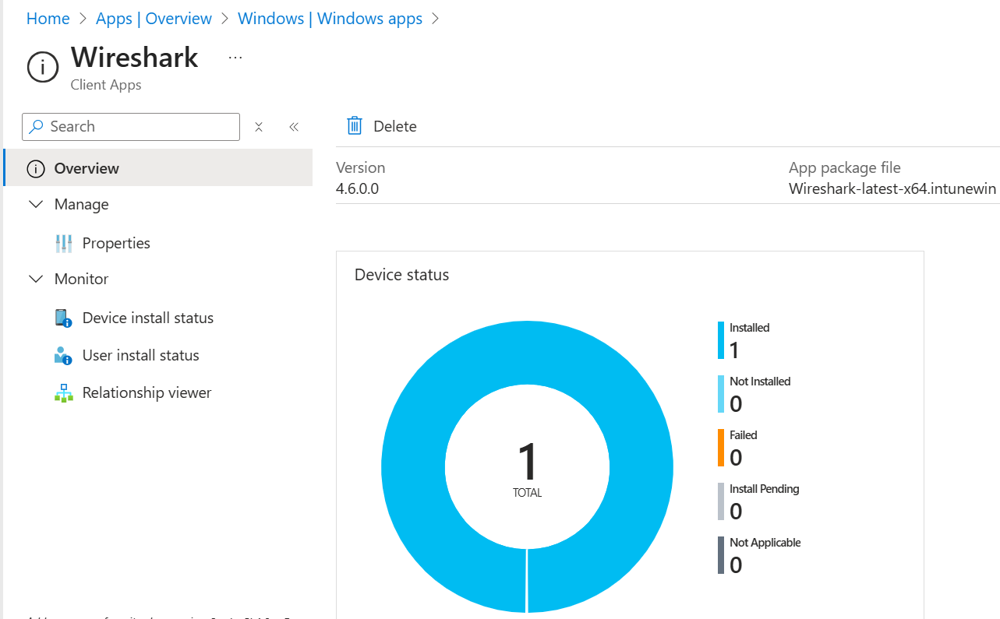

# Chapter 5, Part 4: Deploying Applications with Intune

## Scenario

My Autopilot deployment was a success! The device is secure and compliant right out of the box. However, it's a bare operating system. An employee can't be productive without applications. My next mission is to use Intune to automatically deploy essential software to my managed devices.

I will tackle two common and important scenarios:
1.  Deploying the core Microsoft 365 Apps suite (Word, Excel, PowerPoint, etc.).
2.  Deploying a critical third-party application, Google Chrome, which requires packaging it for Intune.

## Ticket 1: Deploying Microsoft 365 Apps

**My Mission:** To deploy the Microsoft 365 Apps suite as a required application for all devices in the IT department. Intune has a built-in wizard for this, which makes the process streamlined and reliable.

**Actions I Will Take:**

1.  **Navigate to Windows Apps:** In the **Microsoft Intune admin center**, I will go to **Apps > Windows**.

2.  **Add the App Suite:**
    *   I will click **+ Create**.
    *   Under the "Microsoft 365 Apps" section, I will select **Windows 10 and later** and click **Select**.

3.  **Configure App Suite Information:**
    *   **Suite Name:** I'll leave the default, `Microsoft 365 Apps for Windows 10 and later`.
    *   **Description:** I'll add a simple description like, `Core Office suite including Word, Excel, PowerPoint, Outlook, and Teams.`
    *   I will ensure "Show this as a featured app in the Company Portal" is set to **Yes**.

4.  **Configure App Suite Settings:**
    *   **Configuration settings format:** `Configuration designer`
    *   **Select Office apps:** I will select `Excel`, `Outlook`, `PowerPoint`, `Teams`, and `Word`.
    *   **Architecture:** `64-bit`.
    *   **Update channel:** `Current Channel` (This is standard for getting the latest features).
    *   I will leave the other settings at their defaults.

5.  **Assign the Application:**
    *   In the **Assignments** section, under **Required**, I will click **+ Add group**.
    *   I will search for and select my `GRP_DEPT_IT` group.
    *   This ensures that the Microsoft 365 Apps are automatically and mandatorily installed on all devices used by the IT department.

6.  **Review and Create:** I will review the summary and click **Create**.

**Outcome:** Intune will now begin pushing the Microsoft 365 Apps suite to all devices that are members of the IT department group. On my Autopilot VM, the installation will start automatically in the background.

---

## Ticket 2: Packaging and Deploying Google Chrome (Win32 App)

**My Mission:** To deploy Google Chrome. Since this is not a Microsoft product, I must first package the installer into a format that Intune can understand (`.intunewin`). This is the standard process for most third-party software.

**Actions I Will Take (Part 1: Preparation):**

1.  **Download the Installer:** I will search for and download the **"Google Chrome Enterprise MSI"** installer. It's crucial to get the MSI version, not the standard EXE.

2.  **Download the Packaging Tool:** I will search for and download the **"Microsoft Win32 Content Prep Tool"** (`IntuneWinAppUtil.exe`) from GitHub. This is a command-line tool.

3.  **Organize Files:** I will create a folder structure on my local machine to keep things clean, for example:
    *   `C:\IntunePackaging\Source\GoogleChrome.msi`
    *   `C:\IntunePackaging\Tool\IntuneWinAppUtil.exe`
    *   `C:\IntunePackaging\Output\`

4.  **Run the Packaging Tool:**
    *   I will open a Command Prompt or PowerShell window and navigate to the tool's folder: `cd C:\IntunePackaging\Tool`
    *   I will run the tool with the following command:
        ```
        .\IntuneWinAppUtil.exe -c C:\IntunePackaging\Source -s GoogleChrome.msi -o C:\IntunePackaging\Output
        ```
    *   The tool will run and create a `GoogleChrome.intunewin` file in my Output folder. This is the file I will upload to Intune.

**Actions I Will Take (Part 2: Uploading and Deploying):**

1.  **Add a New App:** In **Intune > Apps > Windows**, I will click **+ Create** and select the app type **Windows app (Win32)**.

2.  **Upload the Package:** I will select the `GoogleChrome.intunewin` file I just created.

3.  **Fill in App Information:**
    *   **Name:** `Google Chrome`
    *   **Description:** `The Google Chrome web browser for enterprise.`
    *   **Publisher:** `Google LLC`
    *   I will fill in any other required fields.

4.  **Configure Program Settings:**
    *   **Install command:** `msiexec /i "GoogleChrome.msi" /quiet`
    *   **Uninstall command:** `msiexec /x "{DEB25ED9-8726-318A-892A-47433965A61E}" /quiet` (Note: The GUID may vary. Finding the correct uninstall string is a key part of Win32 app deployment).
    *   **Install behavior:** `System`.

5.  **Define Detection Rules:** This is a critical step that tells Intune how to know if the app is already installed.
    *   **Rules format:** `Manually configure detection rules`.
    *   **Rule type:** `MSI`.
    *   The MSI product code should be automatically populated. This is the most reliable detection method.

6.  **Assign the Application:** Just like with the Office apps, I will assign this to my `GRP_DEPT_IT` group as a **Required** application.

7.  **Review and Create:** I will review all the settings and click **Create**.



**Outcome:** I will have successfully packaged a third-party application and deployed it via Intune. After a sync, my VM will automatically install Google Chrome without any user interaction, demonstrating a complete and robust application deployment strategy.

## Deploying Additional Win32 Apps

**My Mission:** To reinforce my Win32 app deployment skills by packaging and deploying two more common utilities: 7-Zip and Wireshark. This will give me more practice with the end-to-end workflow.

**Actions for 7-Zip:**

1.  **Download:** I will find and download the official 64-bit MSI installer for 7-Zip.
2.  **Package:** I will use the `IntuneWinAppUtil.exe` tool to package the `7z-x64.msi` into a `.intunewin` file.
3.  **Create Win32 App:** In Intune, I will create a new Win32 app and upload the package.
4.  **Configure:**
    *   **Name:** `7-Zip`
    *   **Publisher:** `Igor Pavlov`
    *   **Install command:** `msiexec /i "7z-x64.msi" /quiet`
    *   **Uninstall command:** `msiexec /x "{23170F69-40C1-2702-2501-000001000000}" /qn`.
    *   **Detection Rule:** I will use the `MSI` rule type, which should auto-populate the product code.
5.  **Assign:** I will assign 7-Zip as a **Required** application to my `GRP_DEPT_IT` group.



**Actions for Wireshark:**

1.  **Download:** I will find and download the official 64-bit MSI installer for Wireshark.
2.  **Package:** I will use the `IntuneWinAppUtil.exe` tool to package the Wireshark MSI into a `.intunewin` file.
3.  **Create Win32 App:** In Intune, I will create another new Win32 app.
4.  **Configure:**
    *   **Name:** `Wireshark`
    *   **Publisher:** `The Wireshark Foundation`
    *   **Install command:** `msiexec /i "Wireshark-x64.msi" /quiet`
    *   **Uninstall command:** `msiexec /x "{2C7D0BEB-5F36-49F2-B7B4-F9570F5C0FF8}" /qn`.
    *   **Detection Rule:** I will use the `MSI` rule type.
5.  **Assign:** I will also assign Wireshark as a **Required** application to my `GRP_DEPT_IT` group.



**Outcome:** By completing this exercise, I will have proven my ability to reliably package and deploy any standard MSI-based application, a core competency for a device administrator. I will verify the successful installation of both applications on my VM.

## Navigation

- Previous: [Security & Compliance](../04_Security_and_Compliance/)
- Next: [Reporting & Metrics](../06_Reporting_and_Metrics/)
- Back to Root: [README](../README.md)
